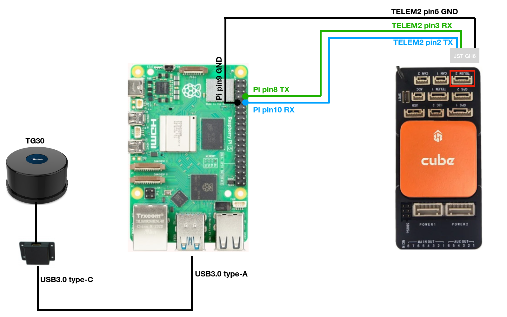

# TG30 with Cubepilot for simple avoidance

Please follow the connection diagram for Raspberry Pi, YDLidar TG30, and Cubepilot

## Ardupilot's Parameters

- SERIAL2_PROTOCOL = 2
- SERIAL2_BAUD = 921
- PRX1_TYPE = 2 # for MAVLink
- SR2_ADSB = 10   # output the object circle on screen
- AVOID_ENABLE = 2 # Proximity or 7 is fine
- AVOID_MARGIN = 2 # stay away in meter 
- OA_TYPE = 0 # Just simple avoidance not Bendy-Ruler
- OA_DB_OUTPUT = 3 # send everything